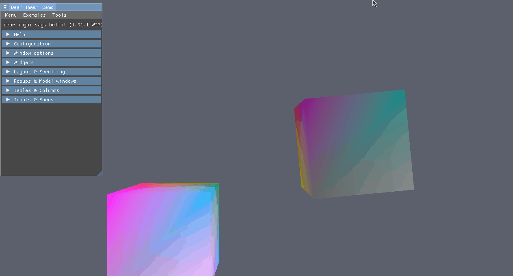
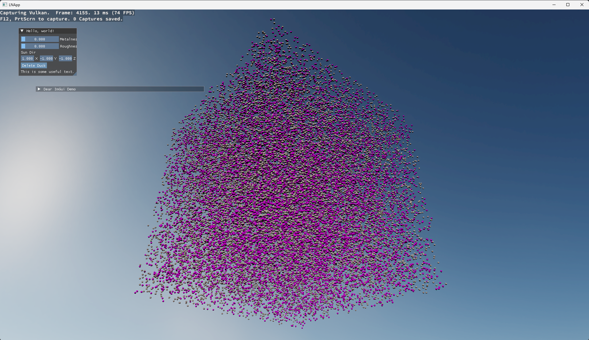
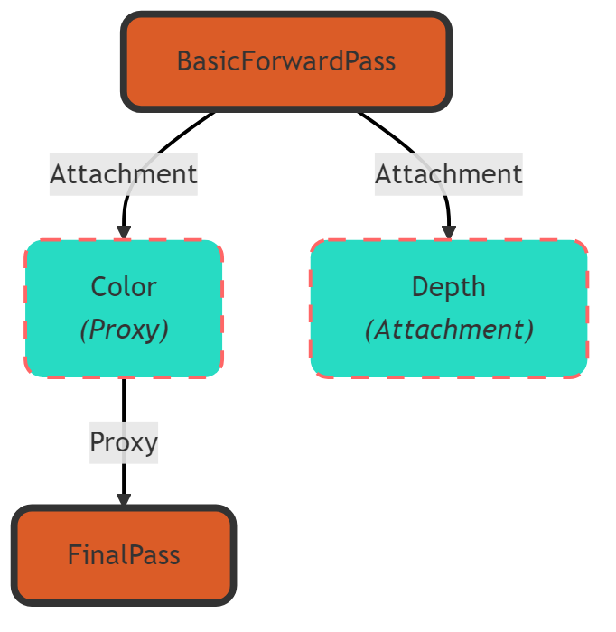
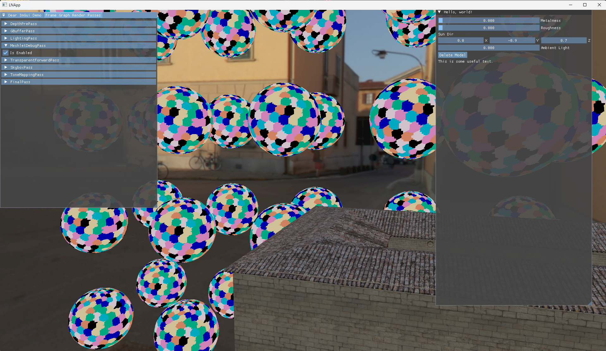

# LNEngine

The Learning engine or LNEngine for short is just a way for me to learn how to built a game engine so this is very much a WIP. At the moment, I'll be focusing on the rendering part of the engine which uses the Vulkan graphics API.
This README is more of a way for me to keep track of what I did and what I'll be doing in an imminent future than a tutorial on how it works although I'll provide some instructions on the topic.

## What I have at the moment

- Application wide event system
- Simple input system
- Simple application loop
- Simple logging system
- Simple ref counting system
- Vulkan initialization
- Swapchain resizing
- Dynamic rendering
- Shader in one file and compiled at runtime with shaderc
- Shader reflection with Spirv-Cross to get the DescriptorSetLayouts out of it
- Programmable Vertex Pulling
- ImGui Initialization
- A simple material system (need to add support for more types of material parameters)
- Bindless textures
- Simple camera system
- Simple skybox
- Simple PBR shader
- Simple model loading (needs more testing)
- Frame graph implementation working
- ECS which is Archetype-based. I took it from [my other ECS project](https://github.com/GuilBlack/ECS) and adapted it to this project
- Shader Spirv caching
- Simple scene system. Still a big WIP
- Meshlets rendering (still experimental and includes only cone culling for now)
- Asynchronous GPU resource loader (textures and models for now)

## Next steps
- Have a scene hierarchy view using ImGui
- Have an inspector for entities/components
- Have a material inspector
- HAVE MORE LIGHTS IN THE SCENE PLEASE
- Implement shadows
- Some comments in the code would be nice...
- Make a better interface with ImGui
- Hot reloading of shaders and materials
- More testing of the ECS and scene system

## How it works

### Setup
For the moment, it only works on Windows with Vulkan version 1.3 and I don't really plan to support a wide variety of devices. I'd like to try and make it work on Linux machines but since I don't have one, it will probably have to wait. I use Visual Studio 2022 to develop this app.

To build the project on Windows:
- Download Vulkan 1.3.283 SDK (it did compile and run with Vulkan 1.4 but with some runtime errors) and include volk, and the debug symbols with it since I'm using them.
- Define a VULKAN_SDK environment variable where the Vulkan SDK is if it's not already defined.
- Clone this repository ***recursively*** with `--recursive-submodules` since I use some libraries as submodules. If you don't have all the submodules cloned, the build will fail. If you've already cloned the repo, you can just run `git submodule update --init --recursive` in the root of the repository.
- launch the `ProjectGen.bat` script located in `vendor/premake/Scripts` from the root of this directory.
- That's probably it unless I forgot something...

The executable is constructed with the LNApp project and the Assets etc are copied to the output directory so that you can just plug and play in renderdoc.
!!! Note that you'll need a GPU that supports Vulkan 1.3 and mesh shaders.

And here is a stress test with 32k spheres which are entities and not particles that runs smoothly at 75fps on my laptop equipped with a GTX 3070ti and a Ryzen 7 6800H:

The frame graph generates a graph in mermaid (mmd) format in the profiling directory. Here is an example of what it looks like:

| Frame Graph |
| --- |
|  |

And a little example of meshlets rendering working alongside normal rendering to conclude. To activate the debug view, just check the "Is Enabled" box in the Meshlet Debug Pass section of the ImGui interface.

Currently, we are using the basic frame graph to render the scene. The complex frame graph is a work in progress.

### Code example

You'll find a code example on how everything works in the LNApp/src/AppLayer.cpp and .h.

## Controls in LNApp

- WASD -> Directional controls.
- Q -> Go down.
- E -> Go up.
- Mouse Left Click + Move the mouse -> Move the orientation of the camera.
