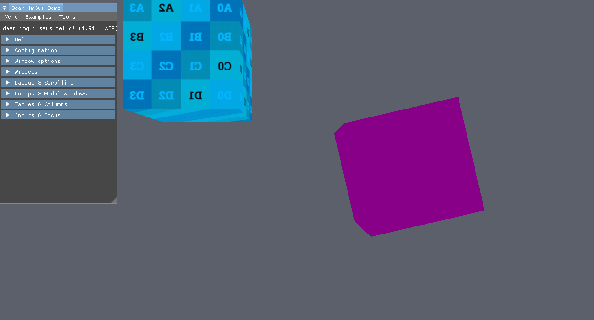

# LNEngine

The Learning engine or LNEngine for short is just a way for me to learn how to built a game engine so this is very much a WIP. At the moment, I'll be focusing on the rendering part of the engine which uses the Vulkan graphics API.
This README is more of a way for me to keep track of what I did and what I'll be doing in an imminent future than a tutorial on how it works although I'll provide some instructions on the topic.

## What I have at the moment

- Application wide event system
- Simple input system
- Simple application loop
- Simple logging system
- Simple ref counting system
- Vulkan initialization
- Swapchain resizing
- Dynamic rendering
- Shader in one file and compiled at runtime with shaderc
- Shader reflection with Spirv-Cross to get the DescriptorSetLayouts out of it
- Programmable Vertex Pulling
- ImGui Initialization
- A simple material system (need to add support for more types of material parameters)
- Bindless textures
- Simple camera system
- Simple skybox
- Texture loading in async

## Next steps

- Integrating a simple PBR implementation
- Model loading with either assimp or tinygltf
- Make a better interface with ImGui
- Make a resource loader
- Shader Spirv caching + just shader cache in general

## How it works

### Setup
For the moment, it only works on Windows with Vulkan version 1.3 and I don't really plan to support a wide variety of devices. I'd like to try and make it work on Linux machines but since I don't have one, it will probably have to wait. I use Visual Studio 2022 to develop this app.

To build the project on Windows:
- Download Vulkan 1.3 SDK and include shaderc, spirv-cross with it.
- Define a VULKAN_SDK environment variable where the Vulkan SDK is.
- Clone this repository recursively since I use some libraries.
- launch the ProjectGen.bat script located in vendor/premake/Scripts from the root of this directory.
- That's probably it unless I forgot something...

The executable is constructed with the LNApp project and the Assets etc are copied to the output directory so that you can just plug and play in renderdoc.
That's about it for now. With all of this, you should be able to run the application and see two beautiful textures (don't mind the UVs) cubes that can change their color based on a material parameter and the ImGui demo. 😊



### Code example
To setup a graphics pipeline, with some materials, it's as simple as this:
```cpp
        auto& fb = lne::ApplicationBase::GetWindow().GetCurrentFramebuffer();
        // Setting the clear color
        fb.SetClearColor({0.105f, 0.117f, 0.149f, 1.0f });
        // Creating the pipeline with depth test enabled
        lne::GraphicsPipelineDesc desc{};
        desc.PathToShaders = lne::ApplicationBase::GetAssetsPath() + "Shaders\\HelloTriangle.glsl";
        desc.Name = "Basic";
        desc.EnableDepthTest(true);
        desc.Framebuffer = fb;
        desc.Blend.EnableBlend(false);

        m_BasePipeline = lne::ApplicationBase::GetRenderer().CreateGraphicsPipeline(desc);

        // Creating the texture
        m_Texture = lne::ApplicationBase::GetRenderer().CreateTexture(lne::ApplicationBase::GetAssetsPath() + "Textures\\UVChecker.png");

        // Creating the material
        m_BasicMaterial = lnnew lne::Material(m_BasePipeline);
        m_BasicMaterial2 = lnnew lne::Material(m_BasePipeline);

        // setting up some properties of the material
        m_BasicMaterial->SetProperty("uColor", glm::vec4(1.0f, 1.0f, 1.0f, 1.0f));
        m_BasicMaterial->SetTexture("tDiffuse", m_Texture);
        m_BasicMaterial2->SetProperty("uColor", glm::vec4(0.25f, 0.25f, 0.25f, 0.25f));
        // if a texture is not set, the material will use a default texture in the bindless array of textures
```
This example code can be found in LNApp.

